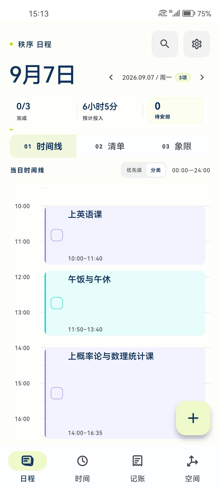
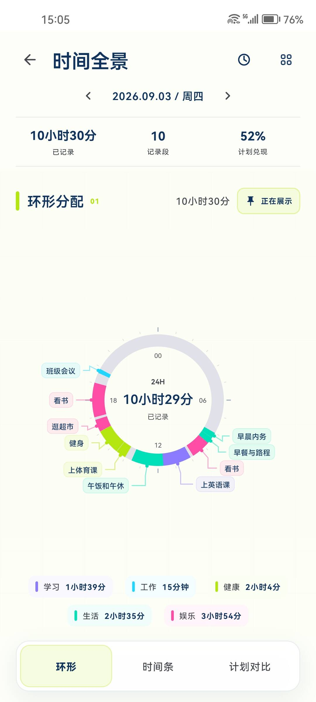
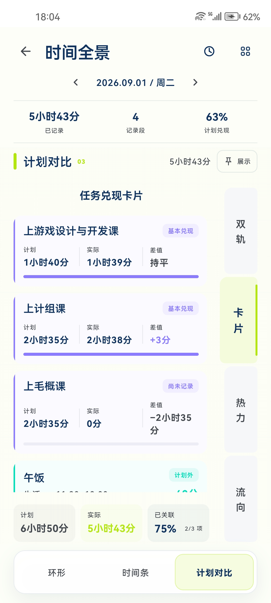
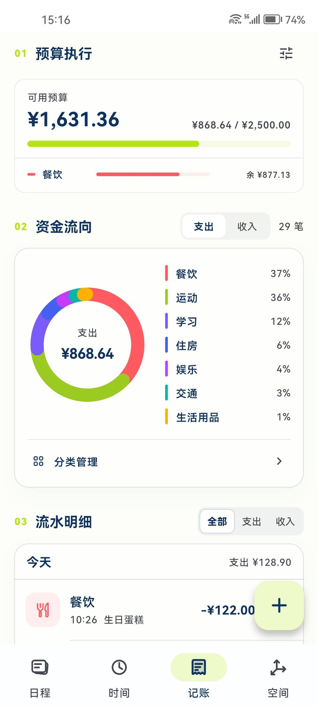
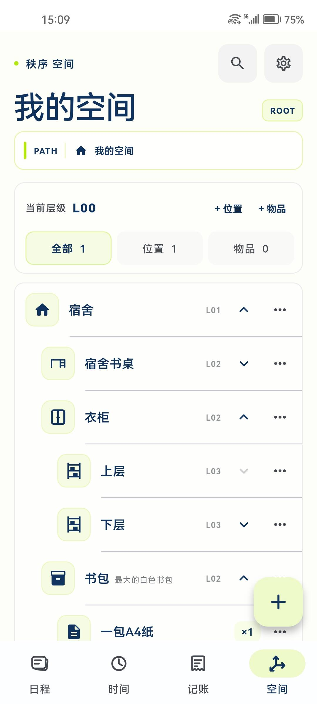

# Order｜秩序

一款连接日程、实际时间、财务与物品空间的个人秩序工具。

> 帮助用户持续成为自己想成为的人。

Order 目前处于 Android 内测阶段。下面的界面来自我的真实使用记录。

## 真实使用界面

<table>
  <tr>
    <td align="center"></td>
    <td align="center"></td>
    <td align="center"></td>
  </tr>
  <tr>
    <td align="center"><strong>日程时间线</strong></td>
    <td align="center"><strong>时间全景</strong></td>
    <td align="center"><strong>计划对比</strong></td>
  </tr>
  <tr>
    <td align="center"></td>
    <td align="center"></td>
    <td></td>
  </tr>
  <tr>
    <td align="center"><strong>预算与资金流向</strong></td>
    <td align="center"><strong>物品空间</strong></td>
    <td></td>
  </tr>
</table>

## 产品理念

秩序不是为生活增加更多约束，而是帮助用户看清时间、行动、金钱和物品如何真实流动。

产品将分散的生活信息组织在一起，并建立一个可以反复调整的反馈过程：

> 安排计划 → 记录事实 → 看见差异 → 调整下一步

它不以制造压力或追求满格数据为目标，而是希望降低记录成本，让用户逐渐认识自己，并作出更清晰的选择。

## 主要功能

- **日程管理**：时间线、任务清单和重要紧急象限
- **时间记录**：正计时、倒计时、手动补记与时间可视化
- **计划联动**：关联日程与时间记录，对照计划和实际投入
- **财务记录**：收支、分类、预算和资金流向分析
- **空间管理**：建立位置层级，记录物品及其完整存放路径
- **本地数据**：数据保存在设备中，支持备份、校验与恢复

## 设计方向

界面以“冷静、克制、轻盈、轻赛博”为主要方向，通过留白、精确排版和有限的荧光绿色建立视觉秩序。

应用固定使用一套浅色主题。设计重点是让信息能够被快速理解和调用。

## 实现与验证

项目使用 Flutter 与 Dart 开发，目前以 Android 为主要平台，并采用本地优先的模块化结构：

- 表现层：页面、交互与数据可视化
- 业务层：日程、时间、财务和空间规则
- 数据层：SQLite 本地数据库、表单草稿与备份恢复
- 系统能力：任务通知、日期时间处理与应用生命周期管理

项目实现了版本化数据库迁移、JSON 全量备份与事务恢复，并建立了覆盖核心控制器、数据校验和关键界面的自动化测试。目前 24 项测试全部通过。

## 我的工作

我负责产品理念、需求定义、功能取舍、信息架构、交互逻辑、视觉方向，以及持续的真机使用、测试和迭代。

开发过程中，我将 OpenAI Codex 作为协作工具，用于代码实现、问题排查、方案整理和工程优化。我负责提出问题、确定需求、判断方案、验证结果，并决定产品最终呈现的形态。

这个项目是我尝试把个人生活中的思考转化为具体产品，并通过持续使用验证想法的一次完整实践。

## 当前状态

Order 目前处于 Android 内测阶段，功能和视觉仍在持续调整。

本仓库仅用于展示产品理念、真实使用界面、技术结构与迭代过程，不包含完整源码，也未开放源码或其他形式的使用授权。
